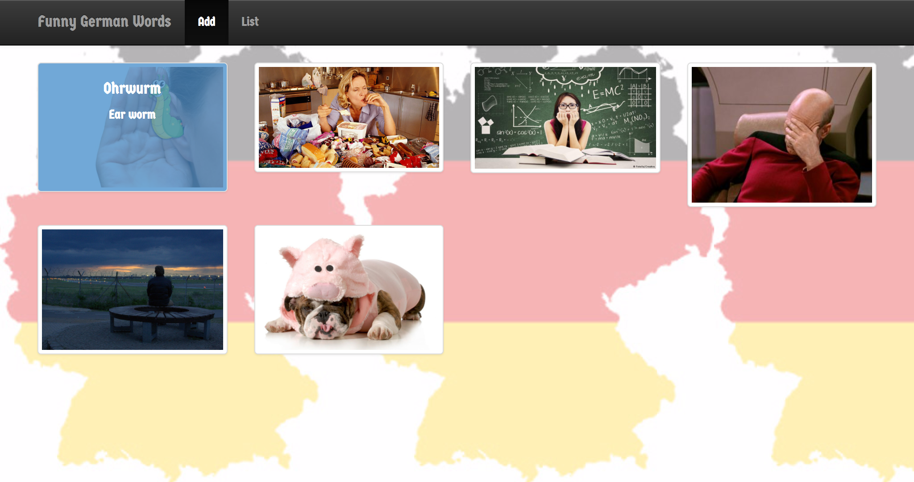

# funny-german-words
A web application that lists some funny German words. Users can add a new word, display it, update it, and delete it. This was my Spring Web MVC project from Week 7 at the Skill Distillery full-stack web development bootcamp.

## In This Document:
1. [Application URL](#application-url)
2. [How to Use the Application](#how-touse-the-application)
3. [Technologies Used](#technologies-used)
4. [Future Feature Sets](#future-feature-sets)
5. [Stumbling and Learning Points](#stumbling-and-learning-points)

## Application URL
http://www.shaundashjian.com:8080/FunnyGermanWords/

## How to Use the Application
* When first accessing the website, a collection of interactive thumbnails are displayed with a navigation bar at the top of the page
* Hover over a thumbnail to see the funny German word and its literal translation
* Click on the thumbnail to open a detailed description of the word
* In the navigation bar, click on Add to add a new funny word. 
  * This displays a form that you could fill in, providing the word in German, its literal translation, a description, and a picture URL
  * When done, click Add to add the new word. A confirmation message will display
* In the navigation bar, click on List to see a list of all funny German words available on the site
  * This displays a list with an Edit and Delete buttons for each item
  * Click the Edit button to edit the details of the German word
  * Click the Delete button to delete the word from the list

## Technologies Used
  * [Spring Web MVC framework](https://docs.spring.io/spring/docs/current/spring-framework-reference/html/mvc.html){:target="_blank"}
  * JSP with Bootstrap
  * JUnit
  * Gradle
  
## Future Feature Sets:
  * The ability to add videos to new and existing words
  * The ability to search for a certain word
  * Replace the local file and list with a database on the back-end
  * Add a blog about German language to the site
  
## Stumbling and Learning Points:
  * It took some time to have all dependencies added with the correct version
  * Linking a background-image by setting the property in the .css file did not work. Instead, I had to embed the style in every html file as a workaround
  * I learned how to include a jsp snippet using `<jsp:include page="navbar.jsp" />`. This helped have the navigation bar in one .jsp file instead of repeating the code in every page jsp.

[Up](README.md)
